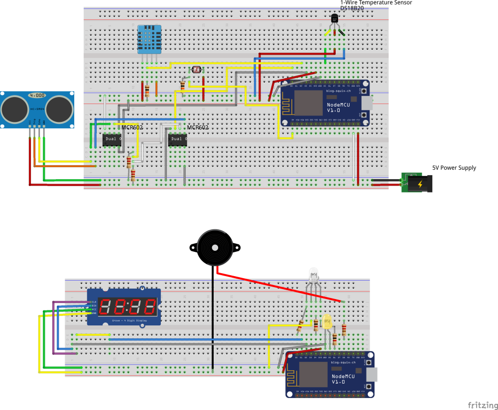
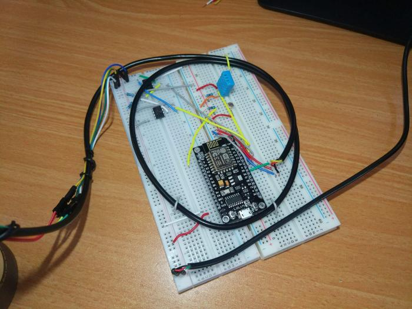
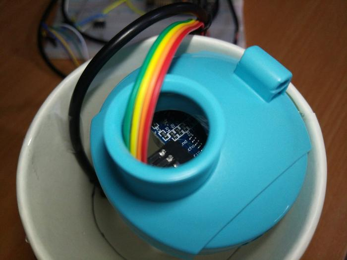
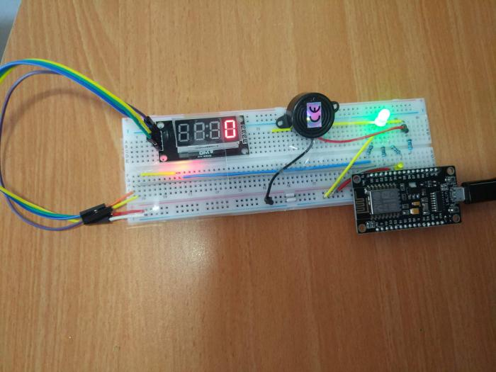

# Smart Bottle
This repository contains the code and fritzing scheme for a smart bottle project I've made for an IoT course in college.

The prototype uses a paper cup instead of an actual bottle due to issues in distance measurement.









## Functionality
* Water level measurement and display
* Audible drinking reminders
* Night light (Helps finding the bottle in the dark)
* Temperature measurement and indication
* Cloud connectivity and dashboard (Ubidots)

## Hardware Requirements
* 2 NodeMCU ESP8266 boards - one for the inputs and one for the outputs
* A DHT11 temperature sensor (for temperature measurement outside the bottle)
* A DS18B20 temperature sensor (for temperature measurement inside the bottle)
* A photoresistor (for light measurement)
* An HC-SR04 ultrasonic distance sensor (for water level measurement)
* A piezo speaker (for drinking reminders)
* An RGB LED (for temperature indication - red is too hot, green is fine and blue is too cold)
* A 7-Segment display with TM1637 driver (for numerical water level display, in ml)
* A yellow LED (for night light)

## Software Requirements
* NodeJS
* Python 3.6 or above
* The NodeMCU boards should have the latest version of MicroPython [flashed](https://docs.micropython.org/en/latest/esp8266/esp8266/tutorial/intro.html#getting-the-firmware)
* (Recommended) PyCharm with [MicroPython plugin](https://plugins.jetbrains.com/plugin/9777-micropython) 

## Getting Started
### Cloning the repository
`git clone https://github.com/OrBin/Smart_Bottle.git --recursive`

### Installing the dependencies
```bash
npm install
pip install -r requirements.txt
```

### Creating a configuration file

A configuration file `config.json` should be placed in directory `src/common/`.

Here is an example for how the configuration file should look:

```json
{
  "wifi": {
    "ssid": "MY_SSID",
    "password": "MY_PASSWORD",
    "connection_timeout_sec": 20
  },
  "ubidots": {
    "api_token": "MY_UBIDOTS_API_TOKEN",
    "device": "MY_UBIDOTS_DEVICE_NAME",
    "device_id": "MY_UBIDOTS_DEVICE_ID"
  },
  "behavior": {
    "measurements_interval_sec": 1,
    "temperature_range": {
      "min": 20,
      "max": 30
    },
    "external_temperature_allowed_offset": 5,
    "night_light_threshold": 40,
    "required_drinking_frequency_minutes": 1
  },
  "bottle": {
    "bottle_capacity_ml": 200,
    "ml_per_cm": 36.36,
    "bottle_height_cm": 10
  }
}
```

### Flashing
Connect the inputs board and run:

`gulp inputs`

Connect the outputs board and run:

`gulp outputs`

## External Modules
This project uses some external modules for controlling components that the basic MicroPython libraries don't include:
* [micropython-hcsr04](https://github.com/rsc1975/micropython-hcsr04) - for controlling HC-SR04 ultrasonic distance sensor
* [micropython-tm1637](https://github.com/mcauser/micropython-tm1637) - for controlling TM1637 7-Segment driver

## License
This project is licensed under the MIT License - see the [LICENSE](LICENSE) file for details

